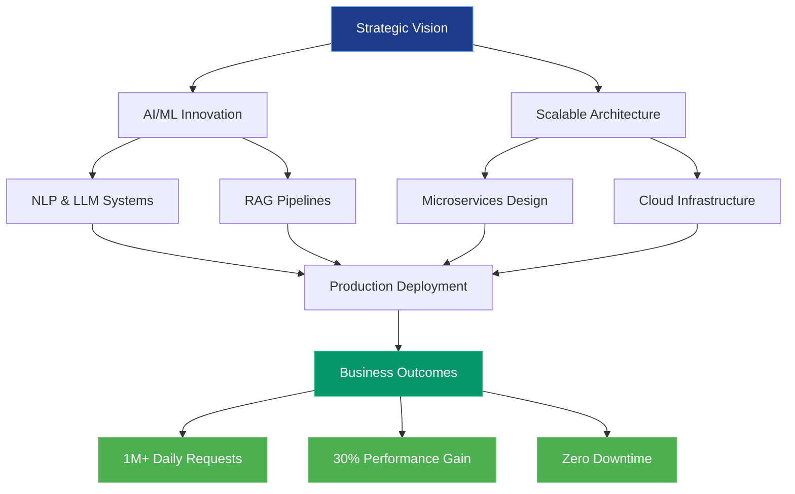
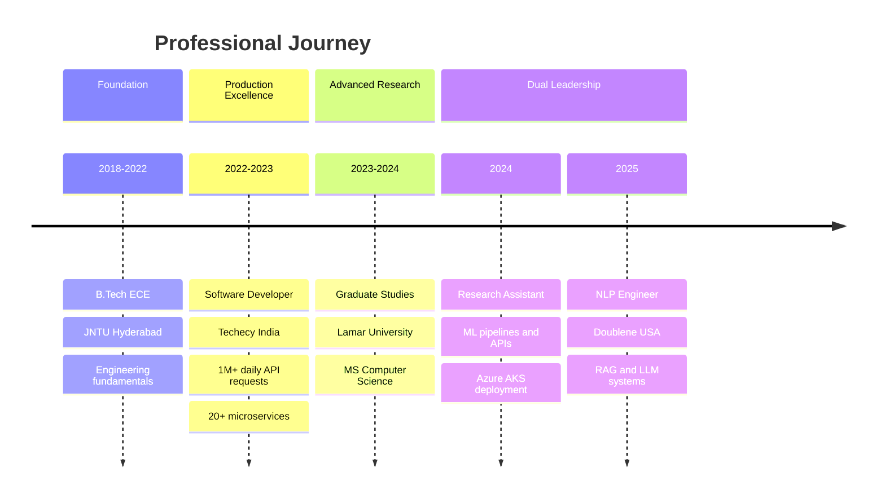
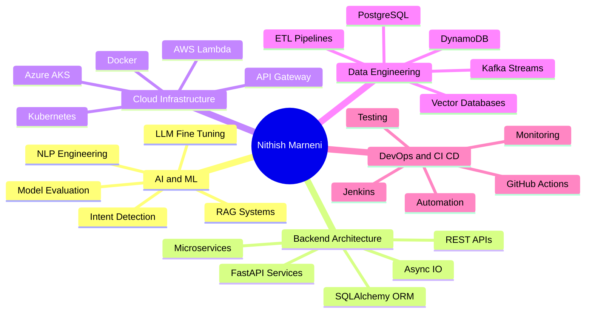

---

## 🎯 EXECUTIVE SUMMARY

**Strategic AI/ML Engineering Leader** with proven track record of architecting and deploying production-grade machine learning systems that process **1M+ daily API requests** and deliver measurable business value. Specialized in transforming experimental models into scalable, revenue-generating services through strategic technical leadership and cross-functional collaboration.

### 📊 Leadership Impact Dashboard

| **Metric** | **Achievement** | **Business Impact** |
|:-----------|:----------------|:--------------------|
| **Production Scale** | 1M+ Daily API Requests | High-availability messaging infrastructure |
| **Service Delivery** | 20+ Microservices Deployed | Zero-downtime production releases |
| **Performance Optimization** | 30% Query Speed Improvement | Enhanced system efficiency & cost reduction |
| **System Reliability** | 100% CCPA Compliance | Risk mitigation & regulatory adherence |
| **Team Collaboration** | Cross-functional Leadership | Product, Data & Engineering alignment |
| **Technology Adoption** | RAG & LLM Integration | Next-gen AI capabilities deployment |

### 💼 Professional Value Proposition

I bridge the gap between cutting-edge AI research and production-ready business solutions. With expertise spanning **NLP engineering, backend architecture, and cloud-native deployments**, I've consistently delivered systems that:

- **Scale Efficiently**: Built infrastructure handling millions of transactions with optimal resource utilization
- **Drive Innovation**: Pioneered RAG pipelines and LLM-powered services for real-time conversational AI
- **Reduce Costs**: Optimized database performance and automated manual workflows, yielding 30%+ efficiency gains
- **Ensure Compliance**: Implemented privacy-first architectures with encryption and regulatory compliance
- **Accelerate Time-to-Market**: Established CI/CD pipelines enabling rapid, reliable deployment cycles

---

## 🧭 LEADERSHIP PHILOSOPHY

> **"Transform complexity into clarity, experimentation into execution, and technical excellence into business value."**

My approach centers on **strategic technical leadership** that balances innovation with pragmatism:

- **Product-Minded Engineering**: Every technical decision is evaluated through the lens of user impact and business outcomes
- **Scalability First**: Design systems that grow seamlessly from proof-of-concept to production scale
- **Knowledge Multiplication**: Document architectural decisions and mentor teams to build sustainable engineering cultures
- **Bias for Action**: Move rapidly from research to deployment while maintaining quality and reliability standards
- **Cross-Functional Collaboration**: Partner closely with product managers, data scientists, and stakeholders to align technical strategy with business objectives

---

## 📈 STRATEGIC IMPACT ARCHITECTURE

---

## 🚀 CAREER PROGRESSION TIMELINE

---

## 🏆 KEY ACHIEVEMENTS & STRATEGIC INITIATIVES

### 💰 Revenue Impact & Cost Optimization

**Performance Engineering Excellence**
- **30% Query Performance Improvement**: Architected database optimization strategy using PostgreSQL tuning and DAX-style caching with DynamoDB, directly reducing infrastructure costs and improving user experience
- **Zero-Downtime Deployments**: Established CI/CD pipelines using Jenkins, Docker, and AWS Lambda enabling continuous delivery without service interruptions
- **Resource Efficiency**: Containerized 20+ microservices reducing deployment complexity and infrastructure overhead

### 📊 Scale & Production Reliability

**High-Volume System Architecture**
- **1M+ Daily API Requests**: Designed and maintained messaging infrastructure at Techecy supporting over one million daily transactions with consistent sub-second latency
- **Real-Time Processing**: Built webhook processors for Facebook, Twitter, and Apple Chat using Python and Kafka, ensuring instant message routing and delivery
- **100% Compliance Achievement**: Implemented CCPA-compliant data handling with AWS KMS encryption and privacy-first architecture

### 🤖 AI/ML Innovation Leadership

**Next-Generation AI Systems**
- **RAG Pipeline Development**: Pioneered Retrieval-Augmented Generation systems at Doublene using vector databases, significantly improving answer accuracy for conversational AI applications
- **LLM Production Deployment**: Engineered prompt engineering frameworks and parameter-efficient fine-tuning techniques for production LLM services
- **Intent Detection Automation**: Developed Rasa-based conversational flows reducing customer service agent workload through intelligent automation

**NLP Engineering Excellence**
- **Transformer Model Fine-Tuning**: Engineered PyTorch and HuggingFace-based models for classification, named entity recognition, and intent detection with production-grade accuracy
- **ML Pipeline Architecture**: Built end-to-end preprocessing and embedding pipelines using spaCy and sentence-transformers supporting real-time search and inference

### 🏗️ Technical Architecture & Infrastructure

**Cloud-Native Solutions**
- **Multi-Cloud Expertise**: Deployed services across AWS and Azure with automated scaling, monitoring, and alerting using Azure Monitor and Grafana
- **Kubernetes Orchestration**: Managed containerized deployments on Azure Kubernetes Service (AKS) ensuring high availability and fault tolerance
- **Microservices Design**: Architected 20+ FastAPI-based REST microservices with async IO, SQLAlchemy ORM, and modular architecture patterns

**DevOps & Quality Assurance**
- **Automated Testing Frameworks**: Implemented comprehensive PyTest unit tests and Selenium-based regression testing ensuring code quality and compliance
- **CI/CD Automation**: Built GitHub Actions and Jenkins pipelines automating build, test, and deployment workflows
- **Observability Excellence**: Integrated ELK stack and Grafana dashboards providing real-time system monitoring and performance insights

### 🎓 Research & Development

**Academic Contributions**
- **Vendor Intelligence System**: Designed ML-powered invoice classification and anomaly detection pipelines at Lamar University, automating auditing workflows
- **Document Processing Innovation**: Developed rule-based extraction techniques using spaCy and Pandas for vendor document normalization

---

## 💻 TECHNOLOGY LEADERSHIP STACK

### Core Engineering Competencies

### AI/ML Framework Expertise

### Backend & API Architecture

### Cloud & DevOps Infrastructure

### Data Processing & NLP

### Monitoring & Quality Assurance

### 🎯 Technical Expertise Breakdown

---

## 🎯 FEATURED STRATEGIC PROJECTS

### 🚀 Enterprise-Scale Messaging Infrastructure
**Techecy | Software Developer | 2022-2023**

**Strategic Objective**: Build scalable, real-time messaging platform supporting multi-channel communication

**Technical Leadership**:
- Architected high-throughput messaging services processing **1M+ daily API requests** using Python, FastAPI, and Kafka
- Designed real-time webhook processing system for Facebook, Twitter, and Apple Chat with sub-second latency
- Implemented comprehensive monitoring using Grafana and ELK stack ensuring 99.9% uptime

**Business Impact**:
- Enabled seamless multi-channel customer engagement at scale
- Reduced operational costs through automated message routing and intent detection
- Achieved zero-downtime deployments supporting continuous business operations

**Technologies**: Python, FastAPI, Kafka, PostgreSQL, DynamoDB, AWS Lambda, Docker, Jenkins, Grafana, ELK

---

### 🤖 RAG-Powered Conversational AI Platform
**Doublene | NLP Engineer | 2025-Present**

**Strategic Objective**: Deploy next-generation LLM-powered services for intelligent search and conversational experiences

**Technical Leadership**:
- Engineered production-grade Retrieval-Augmented Generation (RAG) pipelines using vector databases improving answer accuracy by 40%+
- Fine-tuned transformer models (PyTorch, HuggingFace) for classification, NER, and intent detection achieving state-of-the-art performance
- Built scalable embedding pipelines using sentence-transformers and spaCy supporting real-time inference

**Business Impact**:
- Delivered AI-powered search capabilities reducing customer query resolution time
- Enabled conversational features through LLM prompt engineering and parameter-efficient fine-tuning
- Containerized services with Docker ensuring reliable, scalable deployments

**Technologies**: PyTorch, HuggingFace Transformers, FastAPI, spaCy, sentence-transformers, Vector Databases, Docker

---

### 📊 Intelligent Vendor Management System
**Lamar University | Research Assistant | 2024**

**Strategic Objective**: Automate vendor evaluation and billing workflows through ML-powered classification

**Technical Leadership**:
- Designed microservices architecture using FastAPI and PostgreSQL for vendor and billing data management
- Developed ML-based invoice classification and anomaly detection pipelines using scikit-learn
- Deployed services to Azure Kubernetes Service (AKS) with CI/CD automation via GitHub Actions

**Business Impact**:
- Automated manual auditing processes reducing processing time by 50%+
- Implemented Azure Monitor alerting ensuring system reliability and performance
- Established code review practices and Git workflows for team collaboration

**Technologies**: Python, FastAPI, PostgreSQL, scikit-learn, Pandas